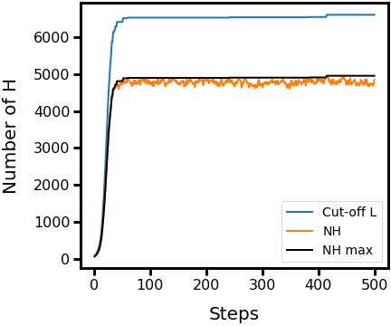
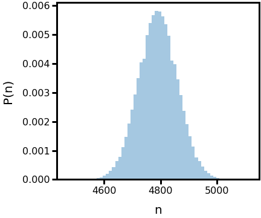
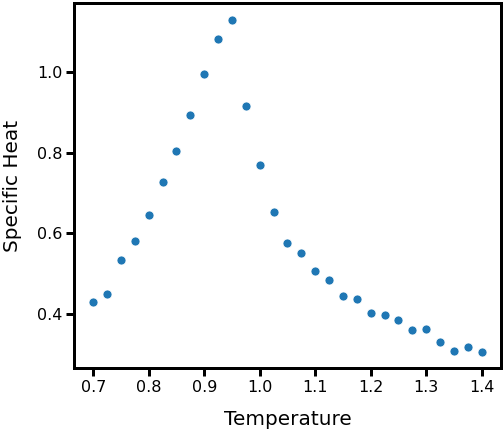
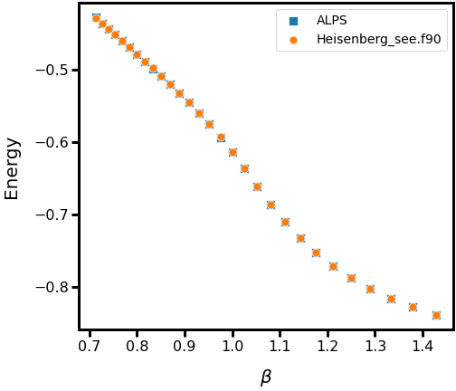
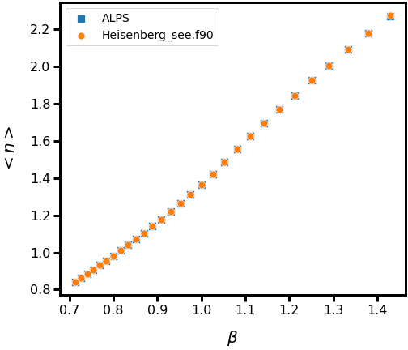
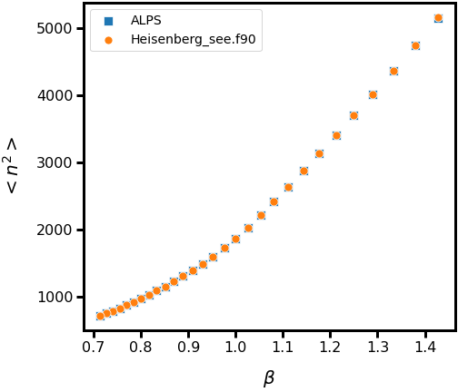
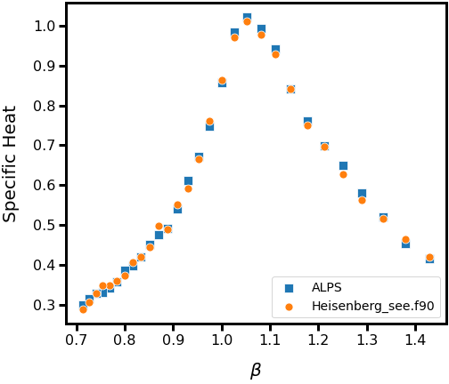
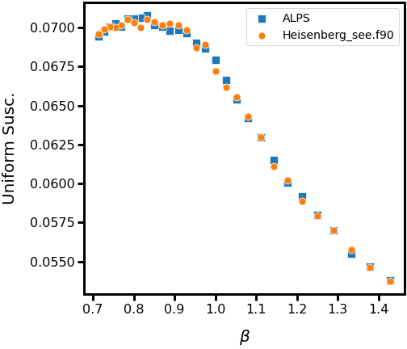

# SSE - Heisenberg spin 1/2

An algorithm to simulate an isotropic S=1/2 antiferromagnetic quantum Heisenberg model in 1D, 2D or 3D lattice, all of them with periodic bondary condition.

The original program was made by Anders W. Sandvik [[1]](http://physics.bu.edu/~sandvik/programs/ssebasic/ssebasic.f90) for a lecture about [Quantum Monte Carlo Methods at Work for Novel Phases of Matter](http://physics.bu.edu/~sandvik/trieste12/index.html), presented in Trieste, Italy, Jan 23 - Feb 3, 2012. A more complete introduction about quantum spin systems and computational methods can be found [here](https://arxiv.org/abs/1101.3281).

## How to use

**Prerequisites:**

- Any Fortran compiler


**For Ubuntu users with gfortran installed run in the terminal:**

```bash
gfortran heisenberg_sse.f90 -o heisenberg && ./heisenberg
```

**Parameters:**

- All the program parameters are in Module Variables.

## Running the tests

In this [lecture](http://physics.bu.edu/~sandvik/trieste12/tut1.pdf) you will find simple tests to check the program correctness. 

**Ground state energy of Heisenberg chain:**

The exact ground state energy is Eg=-0.44395398. So, the mean energy per spin should converge to Eg as the inverse temperature beta goes to infinity, like in the figure below.


Simulation made with a lattice size Lx=32, 10.000 thermalization steps, 10.000 Monte Carlo steps and 20 bins.

**Square lattice expansion cut-off:**

Evolution of the expansion cut-off:



Distribution of the number of H-operators (n):



**Phase transition in a cubic lattice:**

In a cubic lattice this model has a phase transition at Tc = 0.945J [2](https://journals.aps.org/prl/abstract/10.1103/PhysRevLett.80.5196).



**Comparing results from ALPS and this algorithm:**

The ALPS project (Algorithms and Libraries for Physics Simulations) can be found [here](http://alps.comp-phys.org/mediawiki/index.php/Main_Page). 

Energy:



Number of H-operators (n):




Specific Heat:



Uniform Susceptibility:


