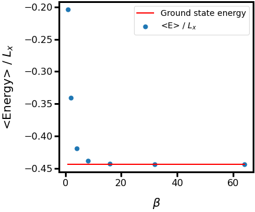

# SSE - Heisenberg spin 1/2

A program made to simulate a quantum Heisenberg model with spin 1/2 in 1D, 2D or 3D lattice, all of them with periodic bondary condition.

The original program was made by Anders W. Sandvik [[1]](http://physics.bu.edu/~sandvik/programs/ssebasic/ssebasic.f90) for a lecture about [Quantum Monte Carlo Methods at Work for Novel Phases of Matter](http://physics.bu.edu/~sandvik/trieste12/index.html), presented in Trieste, Italy, Jan 23 - Feb 3, 2012. A more complete introduction about quantum spin systems and computational methods can be found [here](https://arxiv.org/abs/1101.3281).

(Currently the 3D lattice is in development)

## How to use


**Prerequisites:**

- Any Fortran compiler


**For Ubuntu users run with gfortran installed:**

```bash
gfortran heisenberg_sse.f90 -o heisenberg && ./heisenberg
```

## Running the tests

In this [lecture](http://physics.bu.edu/~sandvik/trieste12/tut1.pdf) you will find simple tests to check the program correctness. 

**Example:**

For a 1D Heiserberg model with spin 1/2 and periodic boundary condition, the exact ground state energy is Eg=-0.44395398. So, the mean energy per spin should converge to  Eg as the inverse temperature beta goes to infinity, like in the figure below.



Simulation made with a lattice size Lx=32, 10.000 thermalization steps, 10.000 Monte Carlo steps and 20 bins.

## License

See the [LICENSE](LICENSE.md) file for license rights and limitations (License type).
